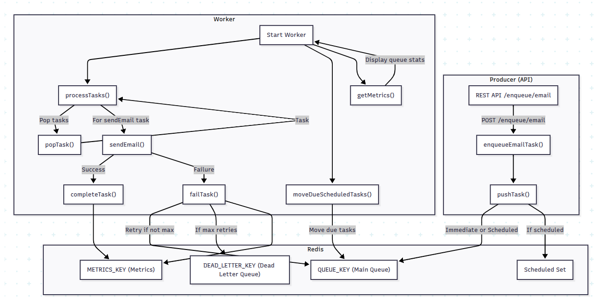

# RedisDistro

A fast, reliable, and extensible distributed queue system built atop Redis, written in TypeScript.  
Perfect for background job processing, such as email delivery, with built-in retries, scheduling, dead-letter queues, and metrics.

---

## Features

- **Redis-powered queue:** Reliable and fast task queue leveraging Redis lists and sorted sets
- **Retry and dead-letter support:** Automatic retries for failed tasks, with configurable dead-letter queue
- **Task scheduling:** Schedule tasks for future execution
- **Worker-based processing:** Scalable worker system to process tasks in parallel
- **REST API producer:** Simple HTTP API for enqueuing and monitoring tasks
- **Metrics:** Built-in queue and worker statistics
- **TypeScript-first:** Modern and type-safe

---
## Architecture Overview

- **Producer API:** Accepts task enqueue requests via HTTP.
- **Redis:** Stores main queue, scheduled tasks, dead-letter queue, and metrics.
- **Worker:** Continuously processes and manages tasks, including retries and failures.



---

## How It Works

1. **Enqueue:**  
   Producer API validates and pushes tasks to Redis (immediately or scheduled).
2. **Worker Loop:**  
   - Periodically moves due scheduled tasks to the main queue.
   - Pops tasks from the main queue and processes them (e.g., sends email).
   - On failure, retries up to max attempts, then moves to dead-letter queue.
   - Updates metrics for processed/failed tasks.
3. **Monitoring:**  
   Both API and worker expose metrics for queue health and throughput.

---

Create a `.env` file with your configuration:

```env
REDIS_URL=
QUEUE_KEY=
DEAD_KEY=
```
## Quick Start

### Install & Setup

```bash
git clone https://github.com/Saloni1707/RedisDistro.git
cd RedisDistro
npm install
```

### Start the Producer API

```bash
npm run producer
# Or: node src/producer/server.js
```

### Start a Worker Process

```bash
npm run worker
# Or: node src/worker/worker.js
```

---

## Usage

### Enqueue a Task

Send a POST request to enqueue an email job:

```http
POST /enqueue/email
Content-Type: application/json

{
  "to": "recipient@example.com",
  "subject": "Your Subject",
  "body": "Your message body",
  "runAt": "tomorrow 8am" 

}
```

**Response:**
```json
{ "message": "Task enqueued", "taskId": "..." }
```

## Contributing

Pull requests and issues are welcome!  
---

## License

MIT © [Saloni1707](https://github.com/Saloni1707)
